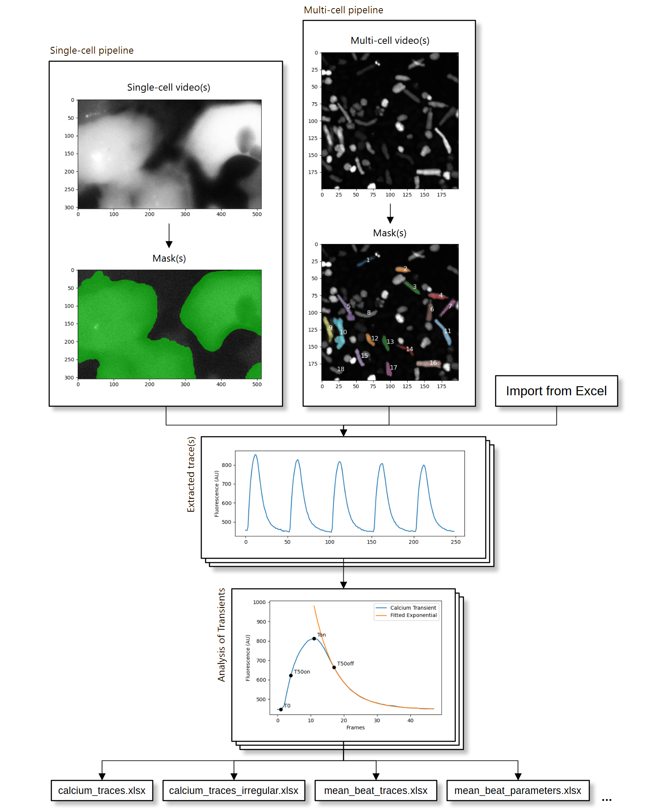

# PyCalTrack: An Enhanced Software Solution for High-Throughput Analysis of Calcium Transients in Cardiomyocytes



PyCalTrack is a a Python redesign of [CalTrack](https://github.com/ToepferLab/CalTrack)'s functionality and architecture which aims to be fully free and open-source. PyCalTrack has two pathways for obtaining calcium traces. It can extract them from videos, or it can import them directly from a prior analysis. Extracting traces from videos involves obtaining masks for the cells in the videos. This masking process is different for single-cell and multi-cell videos. After obtaining traces, they are then analysed, generating a set of calcium measurements of biological relevance. Finally, the results of trace extraction and analysis is saved onto disk in the form of Excel files. Each part of this pipeline will be discussed in-depth in this chapter.

## Pre-requisites

In order to run PyCalTrack on your system, please make sure that you have [Conda](https://anaconda.org/) installed. We recommend using [miniconda](https://docs.anaconda.com/free/miniconda/index.html), as it is a lighter installation, but any distribution of Anaconda should work just as well. We also recommend installing the [libmamba](https://www.anaconda.com/blog/a-faster-conda-for-a-growing-community) environment solver in order to save time during the setup of the virtual environment.To test whether you have Conda installed or not, use the following command:

```bash
conda --version
```

## Installation

### Get a copy of the code

You can get the code on your machine by downloading the code in .zip format from github directly, or you can clone this repository using the following commands:

```bash
git clone REPOSITORY_LINK
cd PyCalTrack
```

### Create and activate the virtual environment

If you are on a unix-based operating system (any Linux distribution, MacOS), you can install the required packages on a conda virtual environment by typing in the following command:

```bash
conda env create --file=environment.yml
```

If you are on Windows, you can do the same thing by typing in the following command:

```bash
conda env create --file=environment_windows.yml
```

Keep in mind that this process may take a few minutes. Once the installation is done, you can activate the Conda virtual environment by typing in the following command:

```bash
conda activate PyCalTrack
```

## Running PyCalTrack

In order to run PyCalTrack, type in the following command:

```bash
python cal_track.py
```

This command will run PyCalTrack on sample videos, specifically the `samples/dataset1_RGECO_SingleCell` dataset. The output of this run should be visible in `samples/dataset1_RGECO_SingleCell/pycaltrack_analysis`.

## Configuring PyCalTrack

```python
from enum import Enum

Usage = Enum("Usage", ["SINGLE_CELL", "MULTI_CELL"])

### WARNING: DO NOT EDIT THIS FILE ABOVE THIS LINE! ###

usage = Usage.SINGLE_CELL
acquisition_frequency = 50
pacing_frequency = 1
apply_photo_bleach_correction = False
beginning_frames_removed = 1
max_pacing_deviation = 0.1
good_snr = False
quiet = True
save_tau_fittings = False

extract_traces = True

videos_directory = "samples/dataset1_RGECO_SingleCell"

trace_path = "samples/dataset1_RGECO_SingleCell/pycaltrack_analysis/calcium_traces.xlsx"
```

In order to modify the behaviour of PyCalTrack, you can edit the `cal_track_config.py` file. Each configurable parameter's data type and usage can be seen in the following table.

| Name                            | Data Type                     | Usage                                                                                                       |
| ------------------------------- | ----------------------------- | ----------------------------------------------------------------------------------------------------------- |
| `usage`                         | `SINGLE_CELL` \| `MULTI_CELL` | Determines which pipeline to use.                                                                           |
| `acquisition_frequency`         | `float`                       | The frame rate of the analysed videos in frames per second.                                                 |
| `pacing_frequency`              | `float`                       | The rate of the external stimulation in Hertz.                                                              |
| `apply_photo_bleach_correction` | `bool`                        | When `True`, photobleach correction will be applied automatically.                                          |
| `beginning_frames_removed`      | `int`                         | The number of frames ignored at the start of the videos.                                                    |
| `max_pacing_deviation`          | `float`                       | How much beats can deviate from specified pacing.                                                           |
| `good_snr`                      | `bool`                        | Determines whether parameter fitting is done on raw or mean transients.                                     |
| `quiet`                         | `bool`                        | When `True`, plots of extracted traces will not be shown to the user.                                       |
| `save_tau_fittings`             | `bool`                        | When `True`, graphs of $\tau$ fittings will be saved along with the analysis of calcium.                    |
| `extract_traces`                | `bool`                        | When `True`, traces will be extracted from videos. When `False`, analysis will be done on extracted traces. |
| `videos_directory`              | `string`                      | The directory containing videos to be analysed.                                                             |
| `trace_path`                    | `string`                      | The path to the Excel file containing extracted traces.                                                     |

## Outputs

PyCalTrack produces outputs saved in Excel files. The outputs mainly consist of five main Excel files:

1. **calcium_traces.xlsx**: This file contains traces extracted from videos. It includes raw traces, corrected traces for photobleaching, as well as their normalised versions. This results in 4 kinds of traces being saved — raw, corrected, normalised raw and normalised corrected — all of which are saved in their own individual sheets.
2. **calcium_traces_irregular.xlsx**: Traces ignored in the beat segmentation process are stored in this file. These traces are retained for additional analysis if required.
3. **calcium_traces_failed_parameters.xlsx**: Traces that failed parameter fitting, typically due to invalid output values, are stored in this file.
4. **mean_beat_traces.xlsx**: This file contains the computed mean calcium transients of each video.
5. **mean_beat_parameters.xlsx**: Parameters fitted to the transients are saved in this file.

If the `good_snr` parameter is set to `True`, PyCalTrack outputs two additional files:

1. **individual_beat_traces.xlsx**: This file contains data for individual transients. Each video has its own sheet, and each column represents one individual transient.
2. **individual_beat_parameters.xlsx**: Parameters fitted to the individual traces are saved here. Each video has its own sheet, and each transient occupies one row in the set of fitted parameters.

## Unit Tests

To run unit tests, type in the following command:

```bash
python -m unittest discover tests
```

## Common Errors

1. `FileNotFoundError: The system cannot find the path specified`: Check if the `videos_directory` and `trace_path` parameters are correct. Also make sure that you are using the correct configuration on `extract_traces`.
2. Analysis of parameters seem to be empty. Check that the correct acquisition frequency and pacing frequency has been put in.
3. `ModuleNotFoundError: No module named 'numpy'`: Activate the virtual environment by typing in `conda activate PyCalTrack`.
